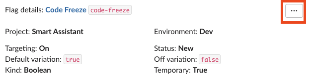
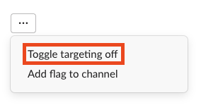
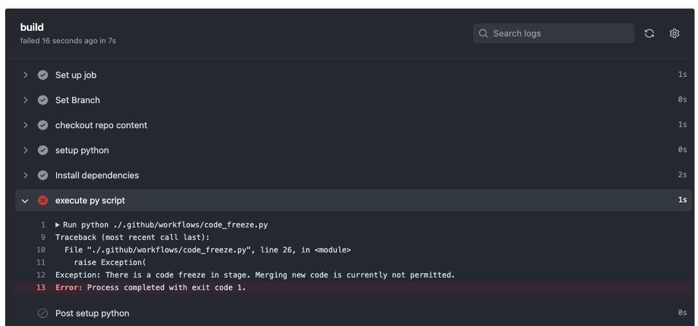

# CodeFreeze Pipeline Integration

## Summary
Block the merging on PRs when a code freeze is in progress by checking a dedicated LaunchDarkly feature flag.

---

## Freezing a TIER 🥶

Triggering a code freeze is done by turning on the `code-freeze` feature flag found in the `smart-assistant` project. 

### Toggling LaunchDarkly Feature Flags in Slack
In the `phsdig.slack.com` workspace, the LaunchDarkly (LD) App had already been setup for us to toggle a specific LD flag to freeze a specific TIER.

<b>Show Instructions</b>

**You can update a flag by running the following Slack command:**
> `/ld flag smart-assistant <dev or stage> code-freeze`

**You'll see the following message populated, select the '...':**

**You can now toggle the flag on/off with the following option:**

 

---

## What a code freeze looks like 👀

<b>Show Details</b>

When there is a code freeze in a particular tier, this fail the `Check Code Freeze` workflow with an exception such as this:

 

---

## How it works 🤔

<b>Show Details</b>

### Tech Stack
- GitHub Actions
- LaunchDarkly

### Setup in new Github Repositories
- Add the LaunchDarkly API key as `LD_API_KEY` (found in the SmartAssistant 1Password vault) in **Settings > Secrets > Actions**
- Add the `CodeFreeze.yml` workflow file and the `code_freeze.py` Python script to the `.github/workflows` directory.

 

---

## FAQ 🙋

<b>Show Details</b>

- **What if the code freeze is over and I want to merge my blocked PR?**
  - If the job failed due to the code freeze as seen in [What a code freeze looks like](#what-a-code-freeze-looks-like), navigate to the failed GH action run and rerun the failed job. If the code freeze is over, this should succeed.
- **Why is my PR blocked when we're not in a code freeze?**
    - The workflow is failing due to setup or an issue with the Python script. Checkout the logs and bring this up to the team if you need help troubleshooting.
    - The `code-freeze` LaunchDarkly flags were not toggled off to reflect the team's claim of a code freeze being over. There is currently no automation to the toggle of these flags, it is manual, even through Slack.

